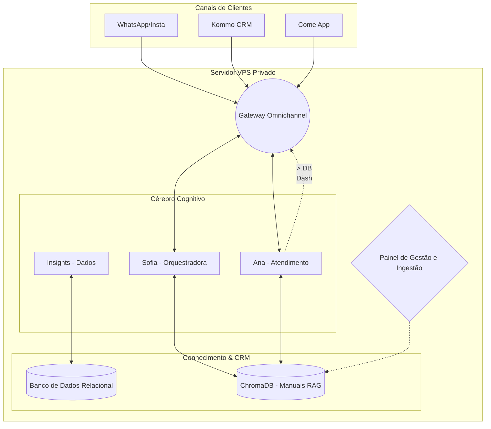

# Doctor Auto AI: Ecossistema Autônomo Multi-Agente
**Documento Executivo de Arquitetura e Visão**

Este documento destina-se a orientar a criação de materiais de apresentação (Pitch Decks, reuniões de status e captação/venda interna). Ele mapeia a robustez do sistema atual traduzindo o "tequinês" em valor de negócio.

---

## Parâmetros para Apresentação (Estrutura de Slides)

### 🔴 SLIDE 1: O Problema Atual vs. A Nossa Solução
> [!WARNING] 
> O Problema: Oficinas automotivas modernas sofrem com perda de leads por lentidão, informações espalhadas (manuais de serviço, PDFs de montadoras, preços) e dependência de "ferramentas de caixinha" (SaaS genéricos) que não entendem a engenharia do negócio.

> [!TIP]
> **A Solução (Doctor Auto AI):** Uma plataforma sob medida guiada por agentes de inteligência artificial autômatos. Em vez de contratar uma ferramenta de chatbot engessada, construímos uma "Força de Trabalho Sintética" proprietária e orquestrada de forma unificada.

### 🔴 SLIDE 2: O Pilar 1 - O Cérebro Digital RAG
**Parâmetro de Conteúdo:** Explicar a diferença entre o ChatGPT genérico e uma IA especialista.
- **Tecnologia:** Cérebro Digital RAG (Retrieval-Augmented Generation) operando via banco vetorial ChromaDB.
- **O que faz?** É a biblioteca da empresa. Antes de dar qualquer resposta de negócio ao cliente, os agentes consultam aqui as apostilas, TSBs (Technical Service Bulletins), histórico de garantias e tabelas de preços da Doctor Auto.
- **Vantagem:** Zero alucinação e conhecimento técnico embarcado estritamente alinhado aos padrões da oficina.

### 🔴 SLIDE 3: O Pilar 2 - A Orquestração Multi-Agente
**Parâmetro de Conteúdo:** Nossa Força de Trabalho Sintética.
- **Sofia (A Orquestradora):** O cérebro central (CEO). Roteia demandas complexas, toma decisões estratégicas e consulta manuais. Trabalha de forma autônoma no backend.
- **Ana (Suporte/Client-Facing):** Primeira linha de frente. Recepciona leads, adquire telemetria do problema do cliente (qual modelo, peça, sintoma) e os armazena no CRM. Empática, ágil e focada em conversão.
- **Insights (Analista de Dados):** Lê logs do sistema, monitora health-checks da oficina e fornece visões de negócio táticas para as tomadas de decisões dos donos da oficina (C-Level Humano).

### 🔴 SLIDE 4: O Pilar 3 - Hub Omnichannel Silencioso
**Parâmetro de Conteúdo:** Como o sistema se conecta ao mundo sem interferir no balcão da loja.
- Um "Gateway Central" construído para suportar volumes massivos de dados, conectando tudo através de pontes de segurança.
- Os agentes AI nunca estão "confinados" a um único canal. O sistema capta passivamente webhooks do **WhatsApp**, **Instagram**, **Kommo CRM** e **Come App**. Toda a magia acontece sem a necessidade da equipe de balcão mudar o software onde eles já trabalham.

### 🔴 SLIDE 5: Infraestrutura e Segurança Proprietária
> [!IMPORTANT]
> **Propriedade Tecnológica (IP):** Toda a operação e o cérebro das automações encontram-se hospedados 100% sob os nossos servidores privados (VPS KVM dedicados na Hostinger). 
> **Vantagem Competitiva:** Os dados da Doctor Auto não ficam expostos em plataformas de integração na nuvem de terceiros. Ganhamos sigilo industrial, redução agressiva de custos operacionais com ferramentas (Zapier, Make genéricos) e controle total da latência do sistema.

---

## Diagrama da Arquitetura para Anexar na Apresentação

Você pode instanciar um diagrama visual que ajuda investidores e diretoria a entender o fluxo dos dados de forma limpa.

---

## Resumo dos "Deliverables" (Entregáveis de Negócio)

Ao finalizar a montagem deste ecossistema, os **três maiores ganhos executivos imediatos** serão:
1. **Redução do Tempo de Resposta a Leads (SLA)** para segundos, sem sacrificar a precisão técnica do atendimento.
2. **Captação Oculta de Dados de Orçamento**, pré-qualificando o lead antes mesmo do vendedor humano tocar nele.
3. Centralização da **base documental da oficina**, antes espalhada em pastas do Google Drive e PDFs pelo WhatsApp, agora transformados em uma inteligência de consulta viva para a própria equipe tirar dúvidas.
